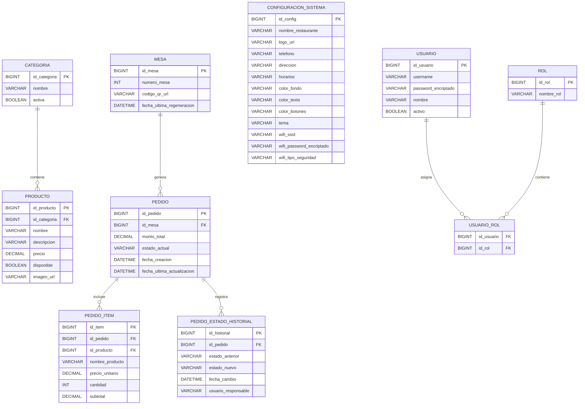

```mermaid
erDiagram

  CATEGORIA {
    BIGINT id_categoria PK
    VARCHAR nombre
    BOOLEAN activa
  }

  PRODUCTO {
    BIGINT id_producto PK
    BIGINT id_categoria FK
    VARCHAR nombre
    VARCHAR descripcion
    DECIMAL precio
    BOOLEAN disponible
    VARCHAR imagen_url
  }

  MESA {
    BIGINT id_mesa PK
    INT numero_mesa
    VARCHAR codigo_qr_url
    DATETIME fecha_ultima_regeneracion
  }

  PEDIDO {
    BIGINT id_pedido PK
    BIGINT id_mesa FK
    DECIMAL monto_total
    VARCHAR estado_actual
    DATETIME fecha_creacion
    DATETIME fecha_ultima_actualizacion
  }

  PEDIDO_ITEM {
    BIGINT id_item PK
    BIGINT id_pedido FK
    BIGINT id_producto FK
    VARCHAR nombre_producto
    DECIMAL precio_unitario
    INT cantidad
    DECIMAL subtotal
  }

  PEDIDO_ESTADO_HISTORIAL {
    BIGINT id_historial PK
    BIGINT id_pedido FK
    VARCHAR estado_anterior
    VARCHAR estado_nuevo
    DATETIME fecha_cambio
    VARCHAR usuario_responsable
  }

  CONFIGURACION_SISTEMA {
    BIGINT id_config PK
    VARCHAR nombre_restaurante
    VARCHAR logo_url
    VARCHAR telefono
    VARCHAR direccion
    VARCHAR horarios
    VARCHAR color_fondo
    VARCHAR color_texto
    VARCHAR color_botones
    VARCHAR tema
    VARCHAR wifi_ssid
    VARCHAR wifi_password_encriptado
    VARCHAR wifi_tipo_seguridad
  }

  USUARIO {
    BIGINT id_usuario PK
    VARCHAR username
    VARCHAR password_encriptado
    VARCHAR nombre
    BOOLEAN activo
  }

  ROL {
    BIGINT id_rol PK
    VARCHAR nombre_rol
  }

  USUARIO_ROL {
    BIGINT id_usuario FK
    BIGINT id_rol FK
  }

  CATEGORIA ||--o{ PRODUCTO : contiene
  MESA ||--o{ PEDIDO : genera
  PEDIDO ||--o{ PEDIDO_ITEM : incluye
  PEDIDO ||--o{ PEDIDO_ESTADO_HISTORIAL : registra
  USUARIO ||--o{ USUARIO_ROL : asigna
  ROL ||--o{ USUARIO_ROL : contiene
```
