# Arquitectura General del Sistema — QRest

Este documento describe la arquitectura técnica del sistema QRest, incluyendo sus componentes principales, comunicación entre módulos y flujo operativo.

---

# 📌 1. Visión General de la Arquitectura

QRest está compuesto por tres grandes componentes:

- **Carta Digital (Frontend React SPA)**: accesible vía QR, utilizada por los clientes.
- **Panel Administrativo (Frontend React + Electron)**: app de escritorio para la gestión interna.
- **Backend (Spring Boot + WebSocket + Base de Datos Local)**: núcleo del sistema.

La aplicación funciona en red local y no depende de servicios externos.

---

# 📌 2. Arquitectura General (Diagrama Mermaid)

---

# 📌 3. Componentes del Sistema

## 🟦 Carta Digital (React SPA)
- Cargada desde el backend.
- Conectada a la red WiFi local.
- Accede al backend vía REST.
- Recibe actualizaciones en tiempo real por WebSocket.
- Funciona como una SPA con React Router.

---

## 🟥 Panel Administrativo (React + Electron)
- Aplicación de escritorio.
- Se comunica con el backend por REST y WebSocket.
- Permite:
  - Ver pedidos pendientes.
  - Cambiar estados.
  - Ver estadísticas.
  - CRUD de productos, categorías, mesas.
  - Cargar configuraciones.

---

## 🟩 Backend (Spring Boot)
Incluye:

### 🔸 API REST
- Gestión de productos.
- Gestión de categorías.
- Gestión de mesas y QR.
- Pedidos y recaudación.
- Configuración del sistema.
- Usuarios y roles.

### 🔸 WebSocket
- Canal para eventos en tiempo real:
  - pedido:nuevo
  - pedido:actualizado
  - mesa:historial_limpiado

### 🔸 Base de Datos
- Tablas principales:
  - productos, categorías
  - mesas
  - pedidos, items, historial estados
  - configuraciones
  - usuarios, roles

---

# 📌 4. Flujo de Pedido (Secuencia)

```mermaid
sequenceDiagram
    participant Cliente
    participant CartaSPA
    participant API
    participant DB
    participant WS
    participant AdminPanel

    Cliente->>CartaSPA: Selecciona productos
    CartaSPA->>API: POST /api/orders
    API->>DB: Guardar pedido + items
    API->>WS: emitir evento pedido:nuevo
    WS->>AdminPanel: Pedido entrante
    AdminPanel->>API: Cambiar estado
    API->>DB: Guardar cambio
    API->>WS: emitir evento pedido:actualizado
    WS->>CartaSPA: Actualización en tiempo real
```

---

# 📌 5. IoT / QR / WiFi

El flujo para acceder a la carta es:

1. Cliente escanea QR.
2. QR incluye credenciales WiFi + URL.
3. El dispositivo se conecta automáticamente al WiFi local.
4. Abre la URL del backend → carga la SPA de React.
5. La carta se comunica con la API vía `local IP`.

---

# 📌 6. Seguridad

- Acceso a panel mediante login (Administradores / Operativos).
- Roles y permisos en backend.
- Contraseñas con BCrypt.
- WiFi password cifrado en BD (AES).
- Peticiones desde red local, reduciendo vectores externos.
- Electron aislado del filesystem.

---

# 📌 7. Estado del documento

✔ Completo  
✔ Coherente con el backlog y el modelo de datos  
✔ Listo para desarrollo  

