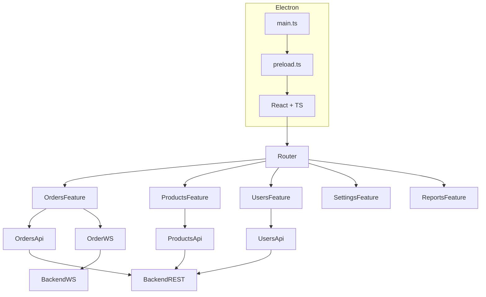

# Arquitectura Frontend — Panel Administrativo (React + Electron + TypeScript + CSS Modules)

Este documento describe la arquitectura oficial del **Panel Administrativo** del proyecto **QRest**.  
Se basa en **React + TypeScript**, empaquetado con **Electron**, organizado **por features** y utilizando **CSS Modules** como estrategia principal de estilos.

---

#  Índice

- [1. Objetivo](#1-objetivo)
- [2. Principios de Diseño](#2-principios-de-diseño)
- [3. Estructura General](#3-estructura-general)
- [4. Detalle por Área](#4-detalle-por-área)
- [5. Estilos con CSS Modules](#5-estilos-con-css-modules)
- [6. WebSocket en el Panel](#6-websocket-en-el-panel)
- [7. Integración Electron (main, preload, ipc)](#7-integración-electron-main-preload-ipc)
- [8. Diagrama Arquitectónico (Mermaid)](#8-diagrama-arquitectónico-mermaid)
- [9. Ventajas](#9-ventajas)

---

# 1. Objetivo

El Panel Administrativo permite gestionar todas las operaciones internas del restaurante:

- Ver pedidos en tiempo real  
- Cambiar estados de pedidos  
- Gestionar productos, categorías y mesas  
- Ver reportes básicos  
- Configurar datos del restaurante  
- Gestionar usuarios internos  
- Ejecutarse como aplicación local mediante **Electron**

La arquitectura debe ser escalable por features, mantenible y clara para desarrollo a largo plazo.

---

# 2. Principios de Diseño

✔ Organización por **features** (módulos funcionales)  
✔ **TypeScript** en todo el proyecto  
✔ Separación estricta entre UI, lógica y servicios  
✔ Integración clara y segura con Electron (IPC + preload)  
✔ WebSocket aislado en el feature de pedidos  
✔ Componentes reutilizables en `shared/`  
✔ **CSS Modules** como estrategia principal de estilos por componente/página  
✔ Estilos globales mínimos (solo lo estrictamente necesario)

---

# 3. Estructura General

```text
src/
 ├── app/
 │     ├── router/
 │     ├── store/
 │     ├── config/
 │     └── App.tsx
 │
 ├── features/
 │     ├── orders/
 │     │     ├── api/
 │     │     ├── components/
 │     │     ├── hooks/
 │     │     ├── pages/
 │     │     ├── types/
 │     │     └── styles/
 │     ├── products/
 │     ├── categories/
 │     ├── tables/
 │     ├── users/
 │     ├── settings/
 │     ├── reports/
 │     └── shared-types/
 │
 ├── shared/
 │     ├── components/
 │     ├── hooks/
 │     ├── utils/
 │     └── styles/
 │
 ├── electron/
 │     ├── main.ts
 │     ├── preload.ts
 │     └── ipc/
 │           ├── ordersIPC.ts
 │           ├── configIPC.ts
 │           └── storageIPC.ts
 │
 └── index.tsx
```

---

# 4. Detalle por Área

##  `app/`

Configuración global de la aplicación:

- `router/` → rutas principales del panel  
- `store/` → estado global (Zustand / Redux Toolkit si aplica)  
- `config/` → `axiosClient`, configuración base, integración con Electron bridge  
- `App.tsx` → layout raíz del panel (navbar, sidebar, etc.)

---

##  `features/` — Organización por Features

Cada feature representa una **área funcional** del panel y contiene sus propios:

- `api/` → servicios HTTP hacia el backend  
- `components/` → componentes específicos del feature  
- `hooks/` → hooks internos de ese feature  
- `pages/` → páginas (rutas) del feature  
- `types/` → tipos TS del dominio del feature  
- `styles/` → estilos CSS Modules específicos del feature

Ejemplo completo del feature `orders`:

```text
features/orders/
 ├── api/
 │     └── ordersApi.ts
 ├── components/
 │     ├── OrderCard.tsx
 │     ├── OrderCard.module.css
 │     ├── OrderStatusBadge.tsx
 │     └── OrderStatusBadge.module.css
 ├── hooks/
 │     ├── useOrders.ts
 │     └── useOrderWebSocket.ts
 ├── pages/
 │     ├── OrdersListPage.tsx
 │     ├── OrdersListPage.module.css
 │     ├── OrderDetailPage.tsx
 │     └── OrderDetailPage.module.css
 ├── types/
 │     └── order.ts
 └── styles/
       └── ordersLayout.module.css    # Layouts o estilos compartidos del feature
```

Otros features (`products`, `users`, `settings`, etc.) siguen la misma idea, adaptando archivos a su dominio.

---

##  `shared/`

Código reutilizable en múltiples features:

```text
shared/
 ├── components/
 │     ├── Modal.tsx
 │     ├── Modal.module.css
 │     ├── Button.tsx
 │     ├── Button.module.css
 │     ├── PageHeader.tsx
 │     └── PageHeader.module.css
 ├── hooks/
 │     └── usePagination.ts
 ├── utils/
 │     ├── formatter.ts
 │     └── validators.ts
 └── styles/
       └── globals.css        # Estilos globales mínimos (reset, fuentes, etc.)
```

---

##  `electron/`

Integración con Electron:

- `main.ts`  
  - Crea la ventana  
  - Configura seguridad de la app  
  - Define comportamiento de la aplicación de escritorio  

- `preload.ts`  
  - Usa `contextBridge` para exponer una API segura a `window`  
  - Por ejemplo: `window.api.getAppVersion()`, `window.api.backupData()`, etc.

- `ipc/`  
  - Módulos separados para manejar diferentes canales IPC entre main y preload:

```text
electron/ipc/
 ├── ordersIPC.ts
 ├── configIPC.ts
 └── storageIPC.ts
```

---

# 5. Estilos con CSS Modules

Toda la aplicación del panel admin utilizará **CSS Modules** para estilos de componentes y páginas.

### ✅ Reglas generales:

- Cada componente/página que necesite estilos propios tendrá un archivo `*.module.css`.
- Clases con nombres simples (`container`, `title`, `button`) ya que CSS Modules se encarga de evitar colisiones.
- Estilos globales solo en `shared/styles/globals.css`.

###  Ejemplo — Componente del feature Orders

**`features/orders/components/OrderCard.tsx`**

```tsx
import React from "react";
import styles from "./OrderCard.module.css";
import type { Order } from "../types/order";

interface Props {
  order: Order;
  onSelect: (orderId: string) => void;
}

export const OrderCard: React.FC<Props> = ({ order, onSelect }) => {
  return (
    <div className={styles.card} onClick={() => onSelect(order.id)}>
      <div className={styles.header}>
        <span className={styles.orderId}>#{order.id}</span>
        <span className={styles.table}>Mesa {order.tableNumber}</span>
      </div>
      <div className={styles.body}>
        <p className={styles.itemsCount}>{order.items.length} productos</p>
        <p className={styles.total}>Total: ${order.total}</p>
      </div>
    </div>
  );
};
```

**`features/orders/components/OrderCard.module.css`**

```css
.card {
  background-color: #ffffff;
  border-radius: 10px;
  padding: 12px;
  box-shadow: 0 2px 6px rgba(0, 0, 0, 0.08);
  cursor: pointer;
  transition: transform 0.08s ease, box-shadow 0.08s ease;
}

.card:hover {
  transform: translateY(-1px);
  box-shadow: 0 3px 10px rgba(0, 0, 0, 0.12);
}

.header {
  display: flex;
  justify-content: space-between;
  margin-bottom: 6px;
}

.orderId {
  font-weight: 600;
}

.table {
  font-size: 0.85rem;
  opacity: 0.8;
}

.body {
  display: flex;
  justify-content: space-between;
  font-size: 0.9rem;
}

.itemsCount {
  margin: 0;
}

.total {
  margin: 0;
  font-weight: 600;
}
```

Esta misma estrategia se replica para:

- Páginas (`OrdersListPage.module.css`, `UsersListPage.module.css`, etc.)
- Componentes compartidos en `shared/components/`.

---

# 6. WebSocket en el Panel

El WebSocket se maneja en el feature `orders` mediante un hook dedicado:

```text
features/orders/hooks/useOrderWebSocket.ts
```

Responsabilidades:

- Conectarse al WebSocket del backend  
- Suscribirse al canal de pedidos  
- Recibir eventos de:
  - nuevo pedido  
  - actualización de estado  
  - cancelación  
- Actualizar la lista de pedidos del panel en tiempo real  

Esto mantiene toda la lógica de tiempo real aislada en el feature de pedidos.

---

# 7. Integración Electron (main, preload, ipc)

### `main.ts`
- Instancia la app de Electron.  
- Crea la BrowserWindow que carga el build de React.  
- Registra los módulos IPC.  

### `preload.ts`
- Usa `contextBridge.exposeInMainWorld` para exponer una API limitada y segura a la app React:
  - `window.api.getVersion()`
  - `window.api.exportData()`
  - etc.

### `ipc/*.ts`
Organizado por responsabilidad:

- `ordersIPC.ts` → operaciones locales relacionadas a pedidos (logs, backups locales, etc.)  
- `configIPC.ts` → lectura/escritura de configuración local.  
- `storageIPC.ts` → manejo de archivos locales, exportaciones, etc.

React nunca accede directamente al sistema operativo; siempre lo hace a través de esta capa controlada.

---

# 8. Diagrama Arquitectónico (Mermaid)



---

# 9. Ventajas

- Organización profesional por features  
- Totalmente compatible con Electron + React + TypeScript  
- CSS Modules aisla estilos y evita conflictos  
- Lógica de negocio concentrada por dominio  
- WebSocket encapsulado en el feature que lo usa  
- Facilita los tests unitarios y de integración por módulo  
- Escalable para agregar nuevos features (por ejemplo: pagos, más reportes, etc.)

---


