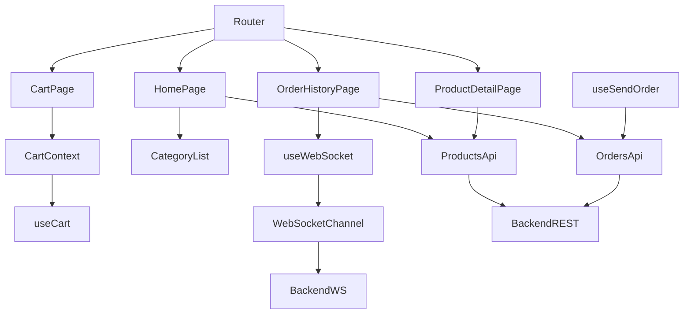

# Arquitectura Frontend — Carta Digital (React + TypeScript + CSS Modules)

Este documento describe la arquitectura oficial del frontend **Carta Digital** del proyecto **QRest**.

La carta es una SPA ligera que los clientes utilizan al escanear el QR de su mesa.  
Su objetivo principal es ser **simple, rápida y altamente mantenible**, sin sobrecarga técnica.

---

#  Índice

- [1. Objetivo](#1-objetivo)
- [2. Principios de Diseño](#2-principios-de-diseño)
- [3. Estructura de Carpetas](#3-estructura-de-carpetas)
- [4. Descripción por Carpeta](#4-descripción-por-carpeta)
- [5. Estilos con CSS Modules](#5-estilos-con-css-modules)
- [6. Diagrama Arquitectónico (Mermaid)](#6-diagrama-arquitectónico-mermaid)
- [7. Ventajas](#7-ventajas)

---

# 1. Objetivo

El frontend de la carta debe:

- Mostrar productos y categorías de forma clara.
- Permitir al cliente armar un carrito.
- Enviar pedidos al backend asociados a la mesa.
- Mostrar el estado de los pedidos (por ejemplo, pendiente, preparando, listo, cancelado).
- Permitir ver el historial de pedidos realizados desde la mesa.
- Funcionar como una **SPA móvil rápida**, sin recargas completas.

Se evita toda complejidad innecesaria, privilegiando simplicidad y velocidad.

---

# 2. Principios de Diseño

✔ Arquitectura simple y modular  
✔ Componentes pequeños y reutilizables  
✔ Hooks para concentrar la lógica del sistema  
✔ Comunicación HTTP centralizada en `api/`  
✔ Estado global mínimo (solo carrito y mesa cuando aplique)  
✔ TypeScript para tipado fuerte  
✔ CSS Modules como estrategia de estilos por componente/página  

---

# 3. Estructura de Carpetas

Los archivos son ejemplos.

```text
src/
 ├── api/
 │     ├── axiosClient.ts
 │     ├── productsApi.ts
 │     ├── ordersApi.ts
 │     └── mesasApi.ts
 │
 ├── components/
 │     ├── ProductCard.tsx
 │     ├── ProductCard.module.css
 │     ├── CategoryList.tsx
 │     ├── CategoryList.module.css
 │     ├── Header.tsx
 │     ├── Header.module.css
 │     └── Loader.tsx
 │
 ├── pages/
 │     ├── Home/
 │     │     ├── HomePage.tsx
 │     │     └── HomePage.module.css
 │     ├── ProductDetail/
 │     │     ├── ProductDetailPage.tsx
 │     │     └── ProductDetailPage.module.css
 │     ├── Cart/
 │     │     ├── CartPage.tsx
 │     │     └── CartPage.module.css
 │     └── OrderHistory/
 │           ├── OrderHistoryPage.tsx
 │           └── OrderHistoryPage.module.css
 │
 ├── hooks/
 │     ├── useCart.ts
 │     ├── useProducts.ts
 │     ├── useSendOrder.ts
 │     ├── useWebSocket.ts
 │     └── useOrderHistory.ts
 │
 ├── context/
 │     └── CartContext.tsx
 │
 ├── types/
 │     ├── product.ts
 │     ├── order.ts
 │     └── mesa.ts
 │
 ├── router/
 │     └── index.tsx
 │
 ├── assets/
 │
 ├── styles/
 │     └── global.css
 │
 ├── main.tsx
 └── App.tsx
```

---

# 4. Descripción por Carpeta

### 📁 `api/`
Servicios HTTP con Axios:

- `axiosClient.ts` → instancia configurada (baseURL, interceptores si aplican).
- `productsApi.ts` → funciones para obtener productos (`getProductsByCategory`, `getProductById`, etc.).
- `ordersApi.ts` → funciones para enviar pedidos y consultar historial.
- `mesasApi.ts` → (opcional) obtener info de mesa si es necesario.

Con esto, todo el acceso a backend queda centralizado y desacoplado de los componentes.

---

### 📁 `components/`
Componentes UI **reutilizables** y **sin lógica de dominio pesada**:

- `ProductCard.tsx` + `ProductCard.module.css`
- `CategoryList.tsx` + `CategoryList.module.css`
- `Header.tsx` + `Header.module.css`
- `Loader.tsx` (spinner / indicador de carga)

Los estilos se definen por componente usando CSS Modules.

---

### 📁 `pages/`

Páginas principales de la SPA:

- `HomePage`:
  - Muestra categorías (via `CategoryList`).
  - Muestra listado de productos inicial.
  - Permite navegar a detalle o agregar al carrito.
- `ProductDetailPage`:
  - Detalles del producto seleccionado.
  - Botón para agregar al carrito.
- `CartPage`:
  - Lista productos del carrito.
  - Permite modificar cantidades / eliminar.
  - Permite enviar pedido (`useSendOrder`).
- `OrderHistoryPage`:
  - Muestra historial de pedidos de la mesa.
  - Escucha cambios de estado vía WebSocket (`useWebSocket`).
  - Permite ver pedidos cancelados y finalizados.

Cada página tiene su propio `.module.css` para estilos específicos de vista.

---

### 📁 `hooks/`

Encapsulan lógica de la app:

- `useCart.ts`  
  Maneja el estado del carrito (agregar, quitar, limpiar, total, etc.).

- `useProducts.ts`  
  Se encarga de cargar productos desde `productsApi.ts`.

- `useSendOrder.ts`  
  Envía el pedido actual del carrito al backend mediante `ordersApi`.

- `useWebSocket.ts`  
  Abre una conexión con el backend (WS/STOMP según implementación) para escuchar cambios de estado u otros eventos.

- `useOrderHistory.ts`  
  Carga el historial de pedidos y lo actualiza cuando llegan eventos desde WebSocket.

---

### 📁 `context/`

- `CartContext.tsx`  
  Provee el contexto del carrito para que cualquier componente o página pueda consumirlo sin pasar props manualmente.

Podrías reemplazarlo por Zustand si preferís, pero como carta es una SPA chica, el Context API puede ser suficiente.

---

### 📁 `types/`

Tipos y modelos de datos en TypeScript:

- `product.ts`  
  Define el shape de `Product`, `ProductDTO`, etc.

- `order.ts`  
  Define `Order`, `OrderItem`, `OrderStatus`, `OrderHistoryItem`, etc.

- `mesa.ts`  
  Define datos asociados a la mesa (id, nombre, código, etc., si aplica).

---

### 📁 `router/`

- `index.tsx` define las rutas principales:

  - `/` → `HomePage`
  - `/product/:id` → `ProductDetailPage`
  - `/cart` → `CartPage`
  - `/history` → `OrderHistoryPage`

---

### 📁 `styles/`

- `global.css`:  
  Reset básico, fuentes, colores generales (muy minimalista).  
  El resto de estilos se maneja con CSS Modules.

---

# 5. Estilos con CSS Modules

Se define como estándar:

- **Un `.module.css` por componente/página** que lo necesite.
- Clases con nombres simples (`card`, `title`, `image`), ya que CSS Modules los aisla.

### Ejemplo: `ProductCard.tsx`

```tsx
import React from "react";
import styles from "./ProductCard.module.css";
import type { Product } from "../types/product";

interface Props {
  product: Product;
  onAddToCart: (product: Product) => void;
}

export const ProductCard: React.FC<Props> = ({ product, onAddToCart }) => {
  return (
    <div className={styles.card}>
      
      <h3 className={styles.title}>{product.name}</h3>
      <p className={styles.price}>${product.price}</p>
      <button
        className={styles.button}
        onClick={() => onAddToCart(product)}
      >
        Agregar
      </button>
    </div>
  );
};
```

### Ejemplo: `ProductCard.module.css`

```css
.card {
  background-color: #ffffff;
  border-radius: 12px;
  padding: 12px;
  box-shadow: 0 2px 8px rgba(0, 0, 0, 0.08);
}

.image {
  width: 100%;
  border-radius: 8px;
  object-fit: cover;
}

.title {
  font-size: 14px;
  margin-top: 8px;
  margin-bottom: 4px;
}

.price {
  font-weight: 600;
  margin-bottom: 8px;
}

.button {
  width: 100%;
  padding: 8px;
  border-radius: 8px;
  border: none;
  font-weight: 600;
  cursor: pointer;
}
```

---

# 6. Diagrama Arquitectónico (Mermaid)



---

# 7. Ventajas

- Código simple y limpio  
- Perfecto para dispositivos móviles (QR en mesas)  
- Arquitectura clara sin sobre-ingeniería  
- Fácil de extender con nuevas vistas o componentes  
- Totalmente alineado con **React + TS + CSS Modules + Axios**  

---

