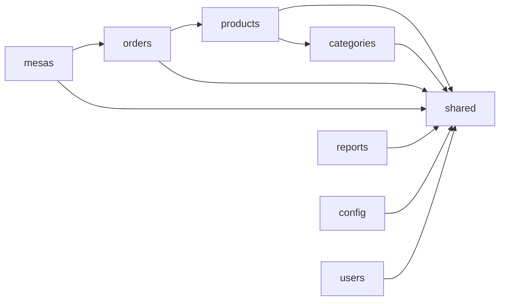
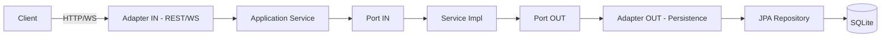

# Arquitectura Backend — QRest (Hexagonal + Módulos DDD + Shared)

Este documento describe la arquitectura definitiva del backend de **QRest**, organizada mediante **Arquitectura Hexagonal**, **Domain-Driven Design (DDD)** y un módulo **shared** para funcionalidad transversal.

---

#  Índice

- [1. Visión General](#1-visión-general)
- [2. Principios Arquitectónicos](#2-principios-arquitectónicos)
- [3. Módulos DDD del Backend](#3-módulos-ddd-del-backend)
- [4. Shared Module](#4-shared-module)
- [5. Estructura de Carpetas Completa](#5-estructura-de-carpetas-completa)
- [6. Relación entre Módulos (Mermaid)](#6-relación-entre-módulos-mermaid)
- [7. Flujo Interno Hexagonal (Mermaid)](#7-flujo-interno-hexagonal-mermaid)
- [8. Ventajas de Esta Arquitectura](#8-ventajas-de-esta-arquitectura)

---

# 1. Visión General

El backend de QRest está construido sobre:

- **Spring Boot**
- **Arquitectura Hexagonal (Ports & Adapters)**
- **DDD aplicado por módulos**
- **Base de datos SQLite**
- **WebSocket y REST API**

Cada módulo se organiza en **domain**, **application** e **infrastructure**, asegurando alta cohesión y bajo acoplamiento.

---

# 2. Principios Arquitectónicos

✔ Separación clara entre:
- **Dominio** (reglas del negocio)
- **Aplicación** (casos de uso)
- **Infraestructura** (REST, WS, JPA, configuración)

✔ Los módulos NO dependen directamente entre sí  
✔ El módulo `shared` provee utilidades comunes  
✔ Las reglas del dominio permanecen puras (sin dependencias de framework)

---

# 3. Módulos DDD del Backend

| Módulo | Responsabilidad |
|--------|------------------|
| **products** | Gestión de productos e imágenes |
| **categories** | Categorías del menú |
| **orders** | Pedidos, ítems y estados |
| **mesas** | Mesas + Códigos QR |
| **reports** | Reportes del sistema |
| **config** | Configuración del restaurante |
| **users** | Usuarios internos y roles |

---

# 4. Shared Module

El módulo `shared` contiene toda la funcionalidad transversal:

```text
shared/
 ├── config/        # Configuración Spring Boot
 ├── exception/     # Manejo global de errores
 ├── util/          # Utilidades comunes
 ├── security/      # Seguridad (Basic / JWT)
 └── websocket/     # Publicación de eventos WebSocket
```

---

# 5. Estructura de Carpetas Completa

```text
src/main/java/com/qrest/
    ├── shared/
    │   ├── config/
    │   ├── exception/
    │   ├── util/
    │   ├── security/
    │   └── websocket/
    │
    ├── products/
    │   ├── domain/
    │   │   ├── model/
    │   │   └── port/
    │   │       ├── in/
    │   │       └── out/
    │   ├── application/
    │   │   ├── dto/
    │   │   ├── mapper/
    │   │   └── service/
    │   └── infrastructure/
    │       ├── adapter/
    │       │   ├── in/rest/
    │       │   └── out/persistence/
    │       └── repository/
    │
    ├── orders/
    │   ├── domain/
    │   │   ├── model/
    │   │   └── port/
    │   │       ├── in/
    │   │       └── out/
    │   ├── application/
    │   │   ├── dto/
    │   │   ├── mapper/
    │   │   └── service/
    │   └── infrastructure/
    │       ├── adapter/
    │       │   ├── in/rest/
    │       │   ├── in/websocket/
    │       │   └── out/persistence/
    │       └── repository/
    │
    ├── mesas/
    ├── reports/
    ├── config/
    ├── users/
    │     (todos con la misma estructura de domain / application / infrastructure)
    │
    └── QRestApplication.java
```

---

# 6. Relación entre Módulos (Mermaid)



---

# 7. Flujo Interno Hexagonal (Mermaid)



---

# 8. Ventajas de Esta Arquitectura

- ✔ Modular, clara y escalable  
- ✔ Testeable (dominio aislado)  
- ✔ Fácil de mantener  
- ✔ Coherente con los ADR y el modelo de datos  
- ✔ Permite agregar nuevos módulos sin romper los existentes  
- ✔ Código ordenado por contexto de negocio

---

